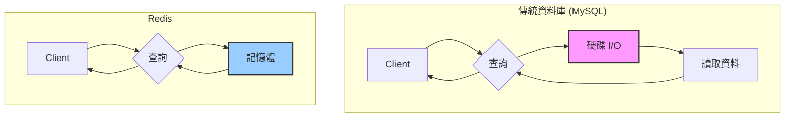
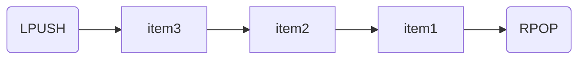
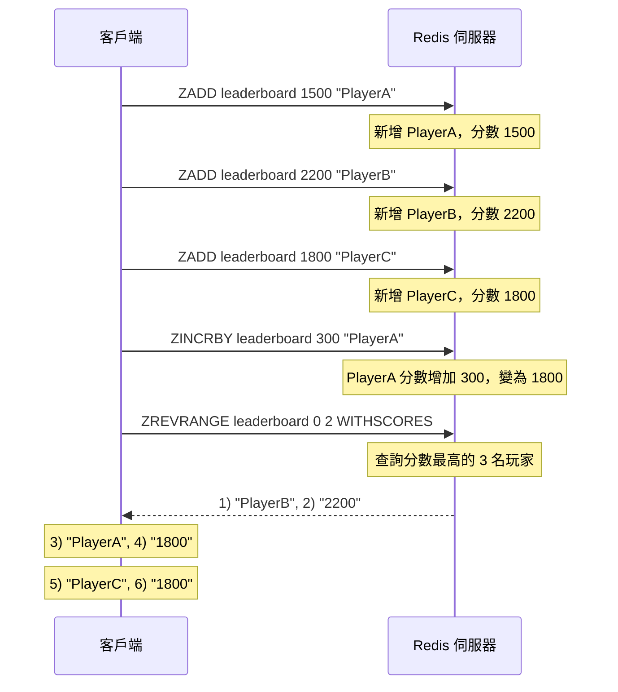

當你的網站或應用程式隨著用戶量增長而變得越來越慢，資料庫查詢成為效能瓶頸時，你可能會聽到一個神奇的名字：Redis。它真的只是個快取(Cache)嗎？為什麼它能如此顯著地提升系統效能？

在現代應用架構中，速度就是一切。無論是電商的商品頁面、社群媒體的訊息流，還是遊戲的即時排行榜，使用者都期待毫秒級的回應。Redis 正是為滿足這種極致效能需求而生的利器。它是一個開源、高效能、基於記憶體的鍵值(Key-Value)資料庫，但它的能耐遠不止於此。

<!-- more -->

## Redis 的核心特性：為什麼這麼快？

Redis 的驚人速度主要源於其設計哲學，它與傳統的關聯式資料庫 (如 MySQL) 在根本上有所不同。



1. **完全基於記憶體 (In-Memory)**：這是 Redis 速度的根本。所有資料都儲存在伺服器的記憶體中，而記憶體的讀寫速度比傳統硬碟快上好幾個數量級。這使得 Redis 的讀寫延遲可以輕易達到微秒級。

2. **單執行緒模型**：你可能覺得很奇怪，單執行緒怎麼會快？Redis 的核心網路請求處理模型是單執行緒的，這讓它避免了多執行緒環境下複雜的上下文切換和鎖競爭所帶來的效能開銷。它專注於把一件事做到極致：處理記憶體中的資料。
    > (註：Redis 6.0 之後引入了多執行緒 I/O，但核心的指令執行依然是單執行緒，這是在不破壞其核心優勢的前提下，進一步提升網路處理能力的優化。)

3. **I/O 多路複用 (Multiplexing)**：Redis 使用 `epoll`、`kqueue` 等高效的 I/O 模型，使其能夠用單一執行緒處理大量的併發網路連接，實現了非阻塞 I/O，極大地提升了併發處理能力。

## Redis 的核心：五種基礎資料結構

Redis 不僅僅是一個簡單的 Key-Value 儲存，它真正的強大之處在於提供了多種為特定場景優化的資料結構。

### 1. String (字串)

最基礎也最常用的資料結構，一個 Key 對應一個 Value。Value 可以是字串、數字甚至是二進位資料。

- **常用指令**：`SET`, `GET`, `INCR` (原子加一), `DECR` (原子減一), `SETEX` (設定帶過期時間的 Key)
- **適用場景**：
  - **快取**：快取資料庫查詢結果、API 回應、HTML 頁面。
  - **計數器**：網站的訪客數量、文章的點讚數。
  - **Session 共享**：在分散式系統中儲存使用者的登入資訊。

```shell
# 設定一個 key，值為 "hello world"
> SET mykey "hello world"
OK

# 讀取 key
> GET mykey
"hello world"

# 設定一個計數器
> SET counter 100
OK

# 將計數器加 1
> INCR counter
(integer) 101
```

### 2. List (列表)

一個雙向鏈結串列，可以在列表的頭部 (Left) 或尾部 (Right) 快速地進行插入和刪除操作。

- **常用指令**：`LPUSH`, `RPUSH`, `LPOP`, `RPOP`, `LRANGE` (讀取範圍內的元素)
- **適用場景**：
  - **訊息佇列**：`LPUSH` 生產訊息，`RPOP` 消費訊息，實現簡單的非同步工作佇列。
  - **文章列表**：儲存最新的文章 ID 列表，實現分頁功能。
  - **動態訊息 (Timeline)**：例如微博或 Twitter 的使用者動態牆。



### 3. Hash (雜湊)

非常適合用來儲存物件。你可以把一個物件的多個屬性 (field-value) 存放在一個 Key 中，方便地對單一屬性進行讀寫。

- **常用指令**：`HSET`, `HGET`, `HGETALL` (獲取所有屬性), `HINCRBY`
- **適用場景**：
  - **使用者個人資料**：儲存使用者的 ID、名稱、Email 等資訊。
  - **商品資訊**：儲存商品的價格、庫存、描述。
    - **快取物件**：將從資料庫查出的物件快取起來，下次更新時只需更新單一欄位。

```shell
# 儲存一個使用者物件
> HSET user:1001 name "Martin" email "martin@example.com" age 30
(integer) 3

# 獲取使用者的名稱
> HGET user:1001 name
"Martin"

# 將年齡增加 1
> HINCRBY user:1001 age 1
(integer) 31
```

### 4. Set (集合)

一個無序、不重複的元素集合。它能高效地進行新增、刪除、以及判斷元素是否存在。

- **常用指令**：`SADD`, `SREM`, `SMEMBERS` (獲取所有成員), `SISMEMBER` (判斷是否存在), `SINTER` (交集), `SUNION` (聯集)
- **適用場景**：
  - **標籤 (Tags)**：為一篇文章或商品新增多個標籤。
  - **共同好友**：計算兩個使用者的共同好友 (交集運算)。
  - **抽獎系統**：儲存所有參與抽獎的使用者 ID，保證唯一性。

### 5. Sorted Set (有序集合 / ZSET)

Set 的升級版，它在 Set 的基礎上為每個元素關聯了一個分數 (score)，並根據這個分數對元素進行排序。這使得 ZSET 成為 Redis 最強大、最靈活的資料結構之一。

- **常用指令**：`ZADD`, `ZREM`, `ZRANGE` (按分數排名獲取), `ZREVRANGE` (反向排名), `ZRANK` (獲取排名)
- **適用場景**：
  - **排行榜**：遊戲積分榜、文章熱度榜、銷售額排行榜。
    - **帶權重的佇列**：根據任務的優先順序 (score) 進行處理。
    - **範圍查找**：例如查找薪資在某一範圍內的所有員工。

## 實戰場景：用 Redis 打造一個簡易排行榜

讓我們看看如何使用 Sorted Set 輕鬆實現一個遊戲積分排行榜。



1. **新增玩家分數**：當玩家獲得分數時，使用 `ZADD`。
    `> ZADD leaderboard 1500 "PlayerA"`
    `> ZADD leaderboard 2200 "PlayerB"`

2. **更新玩家分數**：如果玩家再次得分，可以使用 `ZINCRBY` 來累加分數。
    `> ZINCRBY leaderboard 300 "PlayerA"` (PlayerA 的分數變為 1800)

3. **查詢排行榜 Top 3**：使用 `ZREVRANGE` (從高到低排序) 獲取排名最前面的玩家。
    `> ZREVRANGE leaderboard 0 2 WITHSCORES`
    這會返回分數最高的 3 名玩家及其分數。

只需幾個簡單的指令，一個高效能、即時更新的排行榜就完成了。

## 總結

Redis 遠不止是一個簡單的快取工具。它憑藉其**基於記憶體的高效能**和**豐富多樣的資料結構**，成為了現代應用架構中不可或缺的元件。

- **優點**：
  - **極致的效能**：微秒級的讀寫延遲。
  - **豐富的資料結構**：為多種業務場景提供了最佳解決方案。
  - **原子操作**：大部分指令都是原子性的，無需擔心併發問題。

- **需要注意的點**：
  - **記憶體成本**：所有資料都在記憶體中，成本相對較高。
  - **資料持久化**：雖然 Redis 提供 RDB 和 AOF 兩種持久化方案，但預設配置下仍有丟失少量資料的風險。

理解並善用 Redis 的資料結構，可以讓你更優雅、更高效地解決許多複雜的業務問題。在後續的文章中，我們將會探討 Redis 的持久化機制、主從複製、哨兵模式以及叢集架構，帶你進一步深入 Redis 的世界。
