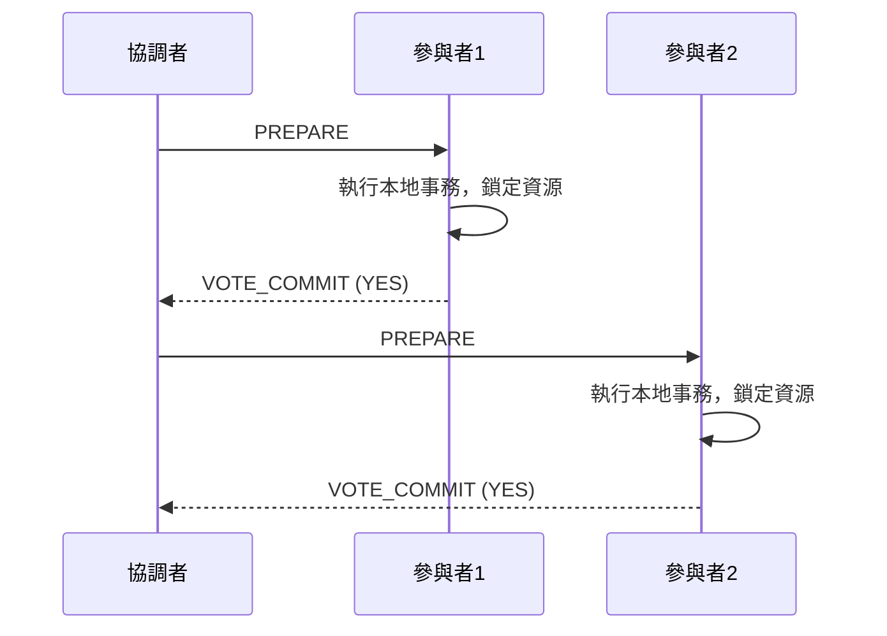
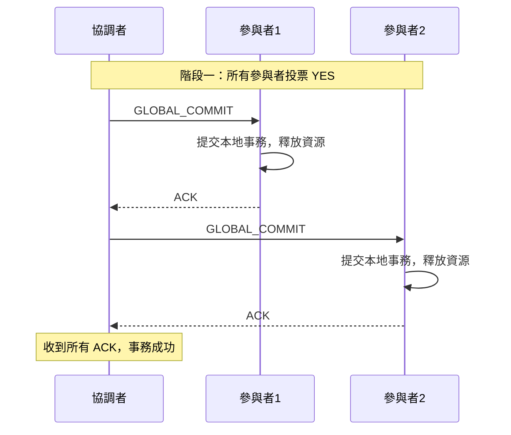
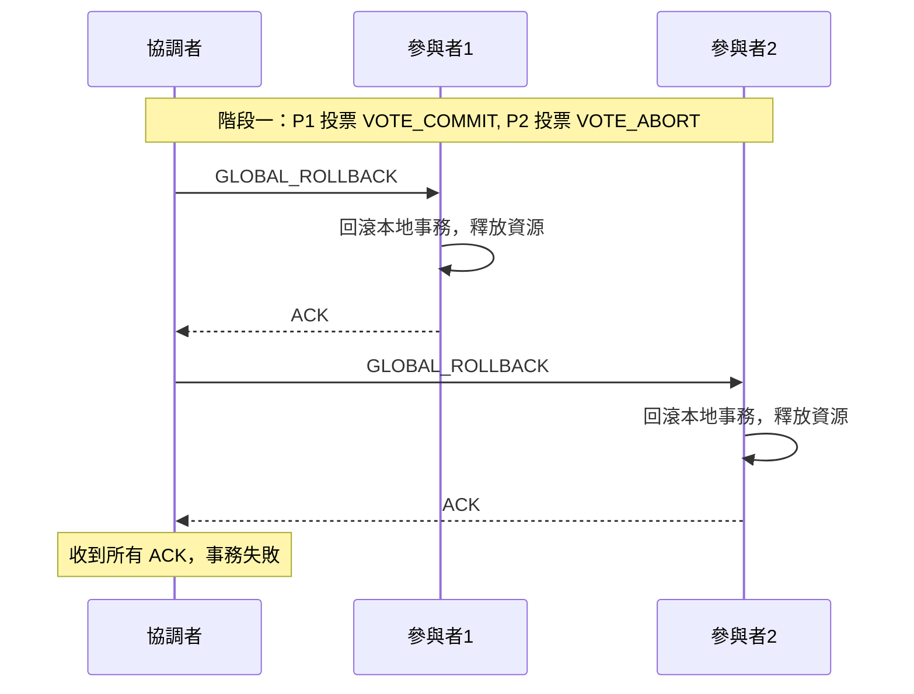
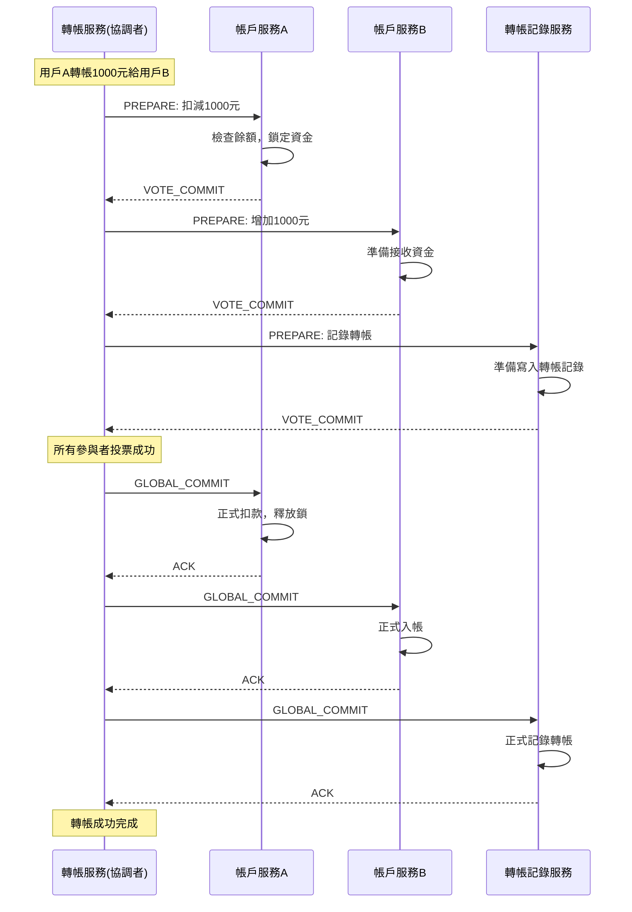
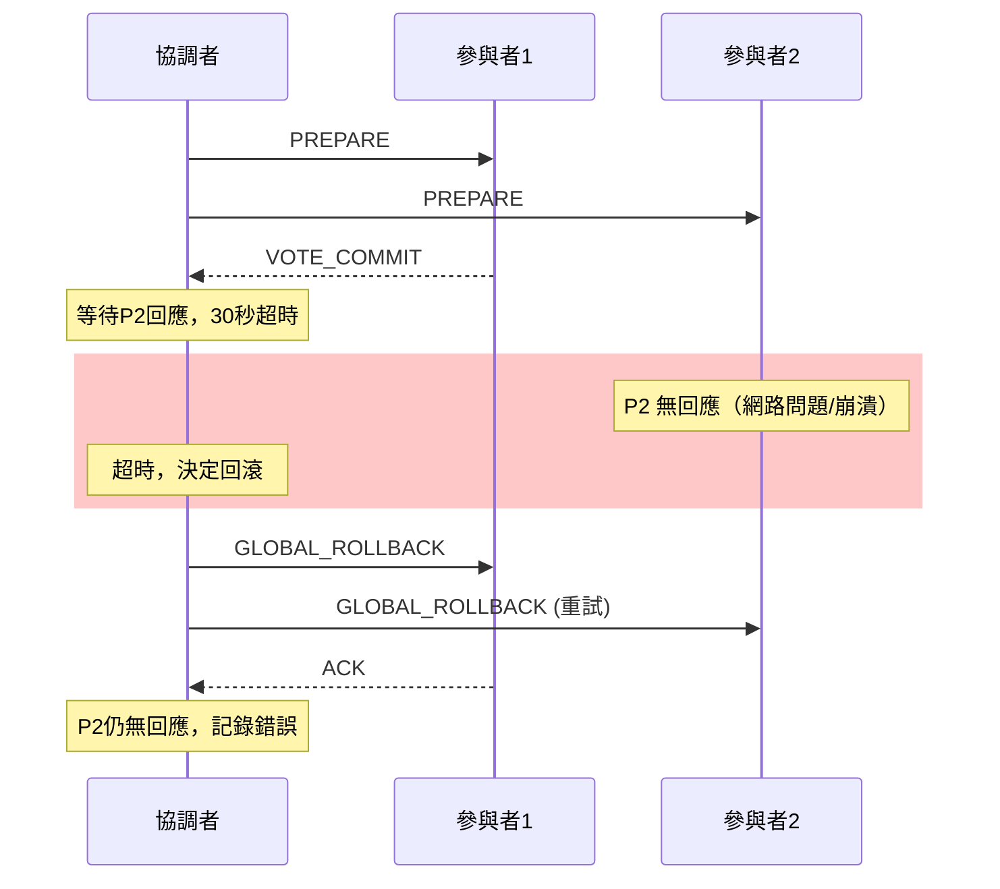
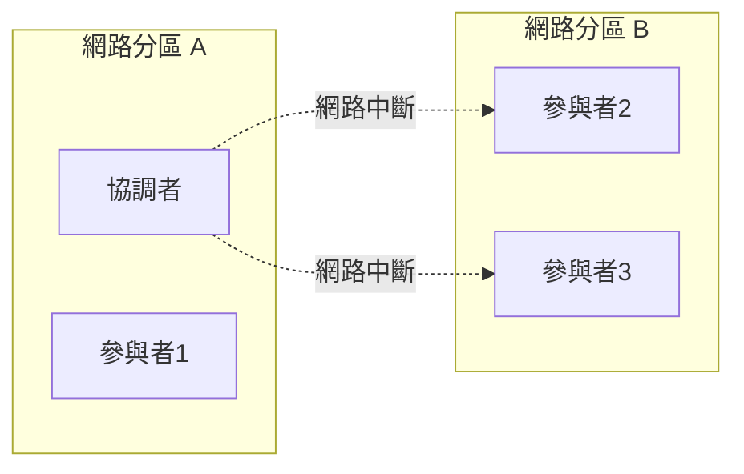

在構建任何大型系統時，數據一致性都是基石。在單體應用中，我們可以依賴資料庫的 ACID 特性來保證事務的原子性。但進入微服務時代，一個業務操作可能橫跨多個獨立的資料庫，我們如何保證這些操作要嘛全部成功，要嘛全部失敗呢？

為了解決這個問題，業界最早提出的、也是最經典的方案之一，就是**二階段提交協議 (Two-Phase Commit, 2PC)**。它試圖將 ACID 的原子性從單一資料庫延伸到分布式系統中。

<!-- more -->

## 2PC 的核心角色

在 2PC 中，有兩種核心角色：

1. **協調者 (Coordinator)**：事務的發起者與仲裁者，負責協調所有參與者的行為，並最終決定事務是提交還是回滾。
2. **參與者 (Participant)**：事務的執行者，通常是各個獨立的服務或資料庫，負責執行本地事務操作。

## 2PC 的兩個階段

顧名思義，2PC 的整個流程分為兩個核心階段：**準備階段**和**提交階段**。

### 階段一：準備階段 (Prepare Phase / Voting Phase)

這是事務的「投票」階段，協調者詢問所有參與者是否「準備好」提交事務。

1. **協調者** 向所有參與者發送 `PREPARE` 請求。
2. **參與者** 收到請求後，開始執行本地事務，但**不會真正提交**。它會鎖定相關資源，並將事務的執行結果（成功或失敗）記錄到本地日誌中。
3. 如果參與者判斷自己可以成功提交，就向協調者回覆 `VOTE_COMMIT` (或稱為 `YES`)。
4. 如果參與者在本地操作中遇到任何問題（如資料庫錯誤、網路異常），就回覆 `VOTE_ABORT` (或稱為 `NO`)。



### 階段二：提交階段 (Commit Phase / Completion Phase)

協調者根據第一階段的投票結果，做出最終決定。

#### 場景A：全部成功，全局提交

如果協調者收到了所有參與者的 `VOTE_COMMIT` 回覆，說明萬事俱備。

1. **協調者** 向所有參與者發送 `GLOBAL_COMMIT` 請求。
2. **參與者** 收到 `COMMIT` 請求後，正式提交本地事務，並釋放鎖定的資源。
3. 完成後，向協調者發送 `ACK` (確認) 消息。
4. 協調者收到所有 `ACK` 後，宣告整個分布式事務成功結束。



#### 場景B：任何失敗，全局回滾

如果在第一階段，有任何一個參與者回覆了 `VOTE_ABORT`，或者在規定時間內沒有回應（超時）。

1. **協調者** 決定中斷事務，向所有參與者（包括那些投了 `VOTE_COMMIT` 的）發送 `GLOBAL_ROLLBACK` 請求。
2. **參與者** 收到 `ROLLBACK` 請求後，根據本地日誌回滾之前的操作，並釋放鎖定的資源。
3. 完成後，向協調者發送 `ACK`。
4. 協調者收到所有 `ACK` 後，宣告整個分布式事務失敗。



## 實際業務場景：銀行轉帳系統

讓我們通過一個經典的銀行轉帳場景來理解 2PC 的實際應用。假設用戶 A 要向用戶 B 轉帳 1000 元：

1. **協調者**：轉帳服務 (Transfer Service)
2. **參與者 1**：用戶 A 的帳戶服務 (Account Service A)
3. **參與者 2**：用戶 B 的帳戶服務 (Account Service B)
4. **參與者 3**：轉帳記錄服務 (Transaction Log Service)



## XA 規範與代碼實現

2PC 是一個理論協議，而 **XA (eXtended Architecture)** 是由 X/Open 組織提出的一個廣泛採用的分布式事務處理規範，它定義了事務管理器 (協調者) 和資源管理器 (參與者) 之間的接口。許多主流資料庫（如 Oracle, MySQL, PostgreSQL）都提供了對 XA 規範的支持，允許它們作為參與者加入到一個全局事務中。

### Spring Boot + JTA 實現 XA 事務

以下是一個使用 Spring Boot 和 Atomikos 實現的 XA 分布式事務範例：

```java
// 1. 配置 XA 數據源
@Configuration
public class XADataSourceConfig {
    
    @Bean(name = "accountADataSource")
    @Primary
    public DataSource accountADataSource() {
        AtomikosDataSourceBean dataSource = new AtomikosDataSourceBean();
        dataSource.setUniqueResourceName("accountADB");
        dataSource.setXaDataSourceClassName("com.mysql.cj.jdbc.MysqlXADataSource");
        dataSource.setXaProperties(getXaProperties("localhost:3306/account_a"));
        return dataSource;
    }
    
    @Bean(name = "accountBDataSource")
    public DataSource accountBDataSource() {
        AtomikosDataSourceBean dataSource = new AtomikosDataSourceBean();
        dataSource.setUniqueResourceName("accountBDB");
        dataSource.setXaDataSourceClassName("com.mysql.cj.jdbc.MysqlXADataSource");
        dataSource.setXaProperties(getXaProperties("localhost:3306/account_b"));
        return dataSource;
    }
    
    private Properties getXaProperties(String url) {
        Properties props = new Properties();
        props.setProperty("URL", "jdbc:mysql://" + url);
        props.setProperty("user", "root");
        props.setProperty("password", "password");
        return props;
    }
}

// 2. 轉帳服務實現
@Service
@Transactional
public class TransferService {
    
    @Autowired
    @Qualifier("accountADataSource")
    private DataSource accountADataSource;
    
    @Autowired 
    @Qualifier("accountBDataSource")
    private DataSource accountBDataSource;
    
    /**
     * XA 分布式事務轉帳
     * 這個方法會自動觸發 2PC 流程
     */
    public void transfer(String fromAccount, String toAccount, BigDecimal amount) {
        try {
            // 階段一：準備階段 - 所有操作都在事務中準備
            debitAccount(fromAccount, amount);    // 扣減 A 帳戶
            creditAccount(toAccount, amount);     // 增加 B 帳戶
            logTransfer(fromAccount, toAccount, amount); // 記錄轉帳
            
            // Spring + JTA 會自動處理 2PC 的兩個階段
            // 如果所有操作成功，自動 COMMIT
            // 如果任何操作失敗，自動 ROLLBACK
            
        } catch (Exception e) {
            // 任何異常都會觸發全局回滾
            throw new TransferException("轉帳失敗: " + e.getMessage(), e);
        }
    }
    
    private void debitAccount(String accountId, BigDecimal amount) {
        try (Connection conn = accountADataSource.getConnection()) {
            PreparedStatement ps = conn.prepareStatement(
                "UPDATE accounts SET balance = balance - ? WHERE id = ? AND balance >= ?");
            ps.setBigDecimal(1, amount);
            ps.setString(2, accountId);
            ps.setBigDecimal(3, amount);
            
            int updated = ps.executeUpdate();
            if (updated == 0) {
                throw new InsufficientBalanceException("餘額不足");
            }
        } catch (SQLException e) {
            throw new DatabaseException("扣款失敗", e);
        }
    }
    
    private void creditAccount(String accountId, BigDecimal amount) {
        try (Connection conn = accountBDataSource.getConnection()) {
            PreparedStatement ps = conn.prepareStatement(
                "UPDATE accounts SET balance = balance + ? WHERE id = ?");
            ps.setBigDecimal(1, amount);
            ps.setString(2, accountId);
            ps.executeUpdate();
        } catch (SQLException e) {
            throw new DatabaseException("入帳失敗", e);
        }
    }
    
    private void logTransfer(String from, String to, BigDecimal amount) {
        // 記錄轉帳日誌到第三個數據源
        // 實現省略...
    }
}

// 3. JTA 事務管理器配置
@Configuration
@EnableTransactionManagement
public class JTAConfig {
    
    @Bean(initMethod = "init", destroyMethod = "close")
    public AtomikosTransactionManager atomikosTransactionManager() {
        AtomikosTransactionManager transactionManager = new AtomikosTransactionManager();
        transactionManager.setForceShutdown(true);
        transactionManager.setDefaultTimeout(30); // 30秒超時
        return transactionManager;
    }
    
    @Bean
    public PlatformTransactionManager transactionManager() {
        return new JtaTransactionManager(atomikosTransactionManager());
    }
}
```

## 2PC 的核心挑戰

2PC 雖然力求實現強一致性，但其設計本身帶來了幾個致命的挑戰，這也使得它在現代高效能、高可用的微服務架構中變得不那麼受歡迎。

### 1. 同步阻塞 (Synchronous Blocking)

這是 2PC 最大的問題。從發送 `PREPARE` 請求到第二階段 `COMMIT/ROLLBACK` 完成之前，所有參與者持有的資源（例如資料庫的行鎖）都處於**鎖定狀態**。如果事務涉及的服務多、執行時間長，將會長時間佔用系統資源，極大地降低系統的吞吐量和性能。

### 2. 超時處理機制 (Timeout Handling)

2PC 中的超時處理是確保系統不會無限期等待的關鍵機制：

#### 協調者超時策略

- **準備階段超時**：協調者等待參與者投票的時間限制（通常 30-60 秒）
  - 如果在超時時間內沒有收到某個參與者的 `VOTE_COMMIT`，自動視為 `VOTE_ABORT`
  - 立即向所有參與者發送 `GLOBAL_ROLLBACK`
- **提交階段超時**：協調者等待參與者確認的時間限制
  - 如果參與者沒有回應 `ACK`，協調者會重複發送 `COMMIT` 或 `ROLLBACK` 指令
  - 設定重試次數上限（如 3 次），超過後記錄錯誤並人工介入

#### 參與者超時策略

- **等待決策超時**：參與者在投票後等待協調者決策的時間限制
  - 如果超時，參與者可以主動查詢協調者狀態
  - 或者與其他參與者通信，嘗試達成一致決策（但這會增加複雜度）



### 3. 故障恢復機制 (Failure Recovery)

2PC 的可靠性很大程度取決於其故障恢復能力：

#### 協調者故障恢復

協調者必須記錄完整的事務日誌才能在崩潰後恢復：

```text
事務日誌格式：
- TRANSACTION_START: <transaction_id>, <participants_list>
- PREPARE_SENT: <transaction_id>, <timestamp>
- VOTE_RECEIVED: <transaction_id>, <participant_id>, <vote>
- COMMIT_DECISION: <transaction_id>, <decision>, <timestamp>
- COMMIT_SENT: <transaction_id>, <participant_id>
- ACK_RECEIVED: <transaction_id>, <participant_id>
- TRANSACTION_END: <transaction_id>, <final_status>
```

協調者重啟後的恢復流程：

1. **讀取事務日誌**，識別未完成的事務
2. **分析事務狀態**：
   - 如果有 `COMMIT_DECISION` 記錄，繼續發送 `GLOBAL_COMMIT`
   - 如果只有 `PREPARE_SENT` 但無決策記錄，發送 `GLOBAL_ROLLBACK`
   - 如果已有 `TRANSACTION_END`，事務已完成，無需處理
3. **重新聯繫參與者**，完成未完成的事務

#### 參與者故障恢復

參與者也需要記錄本地事務日誌：

```text
本地事務日誌：
- PREPARE_RECEIVED: <transaction_id>, <timestamp>
- VOTE_SENT: <transaction_id>, <vote>
- COMMIT_RECEIVED: <transaction_id>, <decision>
- LOCAL_COMMIT/ROLLBACK: <transaction_id>, <timestamp>
```

參與者重啟後：

1. 掃描未完成的事務
2. 如果有 `VOTE_SENT` 但無最終決策，主動詢問協調者
3. 根據協調者回應執行相應操作

### 4. 協調者單點故障 (Single Point of Failure)

協調者的角色至關重要，一旦它出現故障，會產生災難性後果：

- **若在階段二前崩潰**：如果協調者在發送 `GLOBAL_COMMIT` 指令前崩潰，所有已經鎖定資源的參與者將永遠等待下去，無法釋放資源，導致系統假死。
- **若在階段二中崩潰**：如果協調者只向一部分參與者發送了 `GLOBAL_COMMIT` 指令後就崩潰了，會導致一部分服務提交了事務，另一部分還在等待，造成數據不一致。

### 5. 網路分割與數據不一致風險 (Network Partition)

即使協調者沒有崩潰，網路問題也可能導致嚴重後果：

#### 網路分割場景



在這種情況下：

1. **腦裂問題**：協調者無法聯繫到部分參與者，但這些參與者仍在運行
2. **資源長時間鎖定**：分區 B 中的參與者會持續等待協調者的決策
3. **數據不一致**：如果在第二階段發生分割，部分參與者可能提交，部分可能回滾

#### 其他網路異常場景

- **消息丟失**：`PREPARE` 請求丟失，參與者無法投票
- **消息延遲**：超過超時時間的延遲消息可能導致錯誤決策
- **消息重複**：網路重傳可能導致重複處理同一請求

## 總結

2PC 作為分布式事務的早期解決方案，其設計目標明確，就是為了在分布式環境下實現類似本地事務的原子性。

- **優點**：
  - 原理簡單，易於理解。
  - 提供了強一致性（原子性）的保證。

- **缺點**：
  - **性能差**：同步阻塞導致系統吞吐量低下。
  - **可靠性差**：協調者存在單點故障風險。
  - **不適用於微服務**：在高併發、要求高可用的微服務架構中，長時間的資源鎖定是不可接受的。

## 三階段提交 (3PC) 的改進嘗試

為了解決 2PC 的一些缺陷，業界提出了**三階段提交 (Three-Phase Commit, 3PC)**，它在 2PC 的基礎上增加了一個預備階段：

### 3PC 的三個階段

1. **CanCommit 階段**：協調者詢問參與者是否有能力完成事務
2. **PreCommit 階段**：如果都回應可以，協調者發送 PreCommit，參與者執行事務但不提交
3. **DoCommit 階段**：協調者發送最終決定，參與者提交或回滾

### 3PC 的改進點

- **減少阻塞時間**：增加了預備階段，讓參與者更早知道其他參與者的狀態
- **超時自動決策**：參與者在超時後可以自動提交（假設其他參與者都成功）
- **狀態更細緻**：更多的狀態資訊有助於故障恢復

### 3PC 的限制

儘管 3PC 解決了部分問題，但它仍然存在：

- **性能開銷更大**：多了一個階段，增加了網路通信次數
- **複雜度提升**：實現和維護更困難
- **仍無法完全解決網路分割問題**：在某些極端情況下仍可能數據不一致

因此，3PC 在實際生產環境中使用較少，更多是理論上的改進嘗試。

## 性能影響量化分析

為了更好地理解 2PC 對系統性能的影響，以下是一些典型的性能數據：

### 資源鎖定時間分析

```text
單個 2PC 事務的典型時間線：
- 準備階段：100-500ms（取決於參與者數量和網路延遲）
- 決策計算：1-5ms  
- 提交階段：50-200ms
- 總計：151-705ms
```

### 吞吐量影響

在一個典型的電商系統中：

| 場景 | 無分布式事務 | 使用 2PC | 性能下降 |
|------|-------------|----------|---------|
| 訂單處理 TPS | 1000 | 200-300 | 70-80% |
| 平均響應時間 | 50ms | 300-800ms | 6-16倍 |
| 95% 響應時間 | 100ms | 1-3秒 | 10-30倍 |
| 資料庫連接佔用 | 短暫 | 長期鎖定 | 10-20倍 |

### 資源消耗分析

```text
假設系統有以下配置：
- 3個微服務參與分布式事務
- 資料庫連接池大小：20
- 平均事務時間：500ms（使用2PC）

計算：
- 每秒可處理的2PC事務數 ≈ 20 / (0.5秒 × 3服務) ≈ 13 TPS
- 相比本地事務的1000+ TPS，性能下降 98%+
```

### 不同參與者數量的影響

| 參與者數量 | 平均事務時間 | 成功率 | 建議 |
|-----------|-------------|--------|------|
| 2-3個 | 200-500ms | 95%+ | 可接受 |
| 4-5個 | 500ms-1s | 90-95% | 謹慎使用 |
| 6個以上 | 1s+ | <90% | 不建議 |

正是因為 2PC 存在這些難以克服的缺陷，業界才開始探索更為靈活的「柔性事務」方案。在接下來的文章中，我們將會看到 **TCC** 和 **Saga** 模式是如何通過不同的設計思路來應對這些挑戰的。

## 參考資料

- [Wikipedia - Two-phase commit protocol](https://en.wikipedia.org/wiki/Two-phase_commit_protocol)
- [XA Transactions Explained](https://www.oracle.com/database/technologies/xa-transactions-explained.html)
