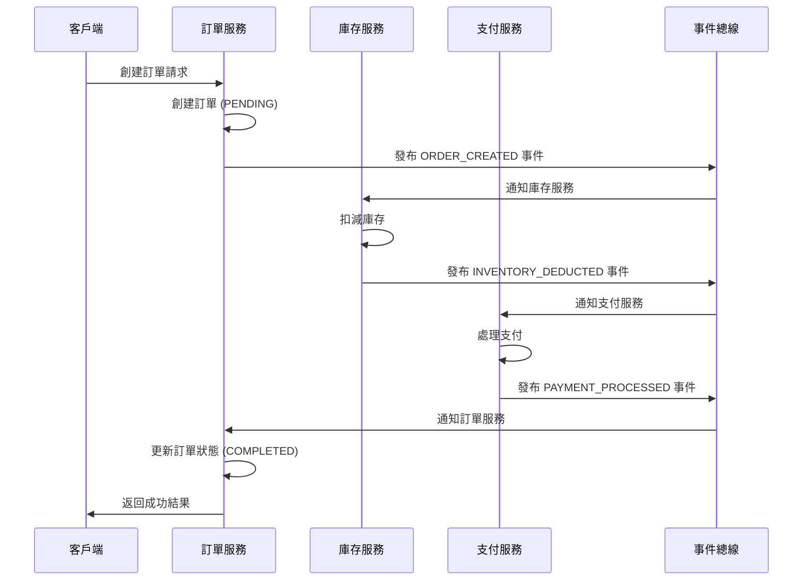
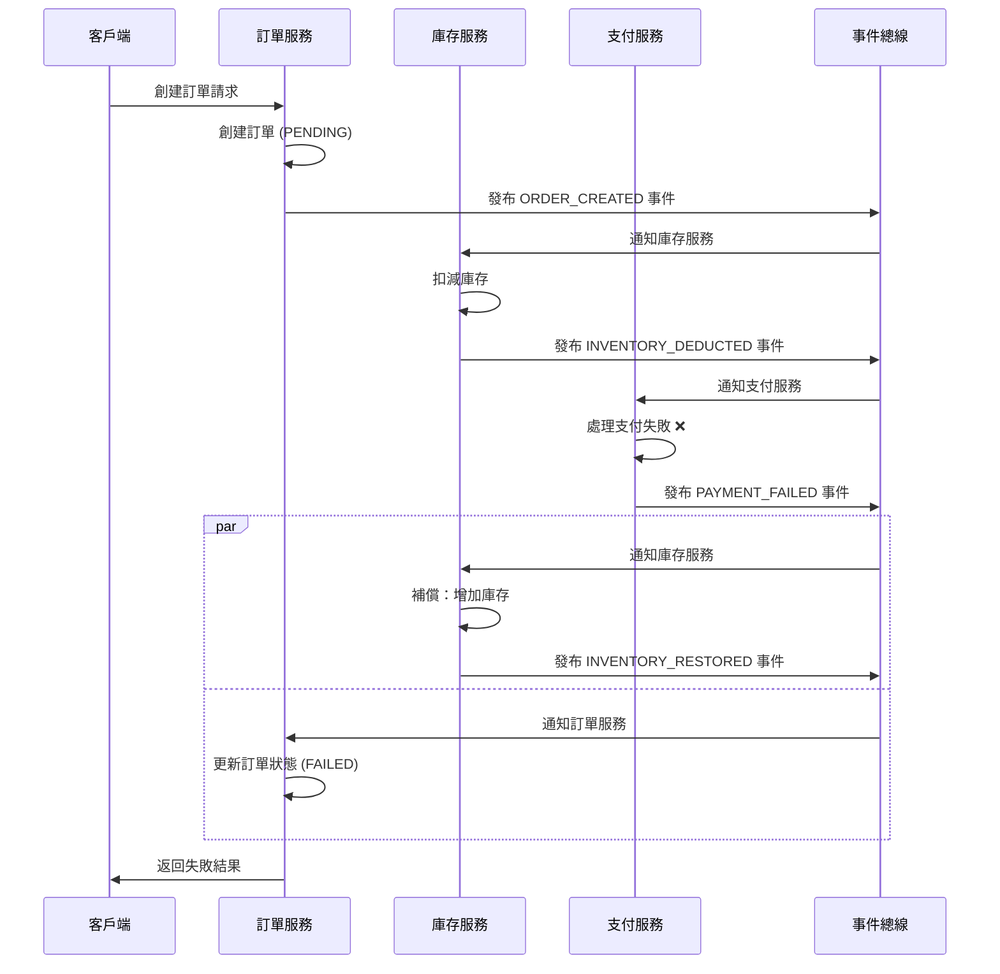
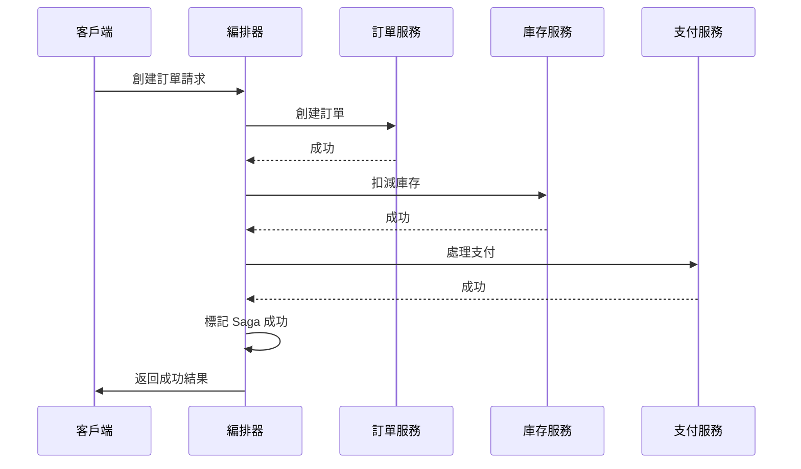
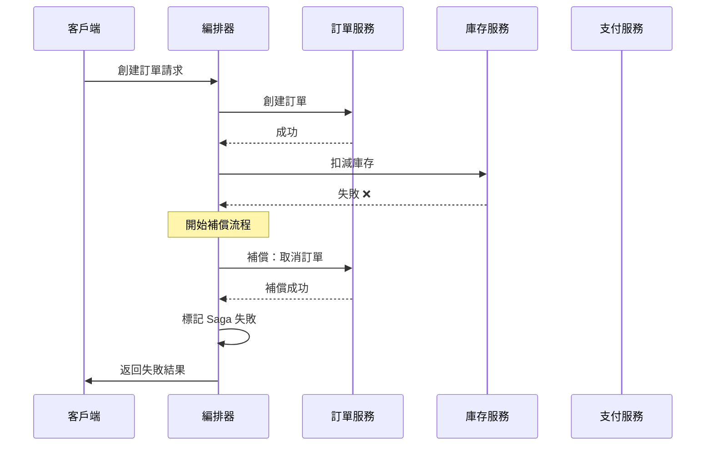
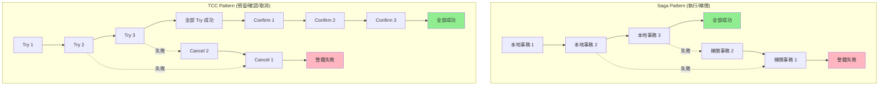

在我們分別探討了追求強一致性的 2PC 協議和基於「資源預留」的 TCC 模式後，本系列文章將迎來最後一位主角：**Saga Pattern**。

如果說 TCC 模式是對 2PC 在應用層的一種改良，那麼 Saga 則提供了一種完全不同的、更為靈活的「補償型」思路來應對分布式事務的挑戰。相較於 TCC 的嚴謹，Saga 以其低業務侵入性和高吞吐量，在許多場景下成為了更受歡迎的選擇。

<!-- more -->

### 為何需要 Saga？傳統二階段提交 (2PC) 的困境

在深入 Saga 之前，我們需要理解為什麼像兩階段提交（Two-Phase Commit, 2PC）這樣的傳統方案在現代微服務架構中捉襟見肘。2PC 雖然能提供強一致性，但其代價是：

- **同步阻塞**：在第一階段，協調器會請求所有參與者鎖定資源。在所有服務都確認前，這些資源會一直被鎖定，在高併發場景下嚴重影響系統吞吐量。
- **協調器單點故障**：協調器是整個系統的「大腦」，一旦它崩潰，所有被鎖定的資源將無法釋放，導致整個流程停滯。
- **不適用於長事務**：對於一個需要幾分鐘甚至幾小時才能完成的業務流程（如旅遊預訂），長時間鎖定資源是完全不可接受的。

正因為這些限制，Saga 這種通過「補償」來達成最終一致性的非鎖定方案，才在微服務領域大放異彩。

## 設計思維

### 長時運行的事務

Saga 的核心思想是將一個長時運行的分布式事務 (Long-Running Transaction, LRT) 拆分成一系列的 **本地事務 (Local Transaction)**。每個本地事務都在單一的服務內完成，並具備 ACID 特性。

> **Saga 的歷史**：這個概念最早由 Hector Garcia-Molina 和 Kenneth Salem 在 1987 年的論文 "Sagas" 中提出，用來處理長時間運行的資料庫事務。

當一個本地事務成功後，Saga 會觸發下一個本地事務。如果所有本地事務都成功，那麼整個分布式事務就宣告成功。

### 補償是關鍵

那如果中途某個本地事務失敗了呢？Saga 會依序執行一系列的 **補償事務 (Compensating Transaction)**，來撤銷之前所有已成功執行的本地事務，從而使系統狀態回滾到初始狀態。

> **補償事務** 必須是冪等的，並且其設計目標是「撤銷」原始操作的影響。例如，「扣減庫存」的補償是「增加庫存」。

## Saga 的兩種實現方式

Saga 主要有兩種協調模式：**協同式 (Choreography)** 和 **編排式 (Orchestration)**。

### 1. 協同式 (Choreography)

在協同式 Saga 中，沒有一個中央的協調者。每個服務在完成自己的本地事務後，會發布一個 **事件 (Event)**，下一個服務監聽到這個事件後，便開始執行自己的本地事務。

**流程範例 (下訂單):**



1. **訂單服務**: 創建訂單 (狀態為 `PENDING`)，發布 `ORDER_CREATED` 事件。
2. **庫存服務**: 監聽到 `ORDER_CREATED`，扣減庫存。成功後發布 `INVENTORY_DEDUCTED` 事件。
3. **支付服務**: 監聽到 `INVENTORY_DEDUCTED`，處理支付。成功後發布 `PAYMENT_PROCESSED` 事件。
4. **訂單服務**: 監聽到 `PAYMENT_PROCESSED`，將訂單狀態更新為 `COMPLETED`。

**如果失敗呢？**



假設支付服務失敗，它會發布 `PAYMENT_FAILED` 事件。

1. **庫存服務**和**訂單服務**會同時監聽到 `PAYMENT_FAILED` 事件。
2. **庫存服務**執行補償操作 (增加庫存)，並發布 `INVENTORY_RESTORED` 事件。
3. **訂單服務**將訂單狀態更新為 `FAILED`。

- **優點**:
  - 簡單直觀，沒有單點故障。
  - 服務之間高度解耦。
- **缺點**:
  - 業務流程分散在各個服務中，難以追蹤和理解。
  - 服務之間存在循環依賴的風險。
  - 測試困難。

### 2. 編排式 (Orchestration)

在編排式 Saga 中，有一個中央的 **編排器 (Orchestrator)**，它負責調用各個參與者服務，並根據結果決定下一步該做什麼。


*(圖片來源: microservices.io)*

**流程範例 (下訂單):**



1. 客戶端請求 **訂單編排器**。
2. **編排器** 調用 **訂單服務** 創建訂單。
3. **編排器** 調用 **庫存服務** 扣減庫存。
4. **編排器** 調用 **支付服務** 處理支付。
5. 如果一切順利，**編排器** 標記整個 Saga 事務成功。

**如果失敗呢？**



假設庫存服務返回失敗。

1. **編排器** 知道庫存服務失敗了。
2. **編排器** 調用 **訂單服務** 的補償操作 (例如，取消訂單)。
3. **編排器** 標記整個 Saga 事務失敗。

- **優點**:
  - 業務流程集中管理，清晰易懂。
  - 更容易監控、測試和維護。
  - 沒有服務間的循環依賴。
- **缺點**:
  - 引入了額外的編排器服務，增加了架構複雜度。
  - 編排器可能成為單點故障。

## Saga vs. TCC 詳細比較

與我們在前一篇文章中深入探討的 TCC 模式相比，Saga 在幾個關鍵特性上有所不同。TCC 的核心是「預留資源」，而 Saga 則是「執行並補償」，這導致了它們在設計和應用上的顯著差異。



| 特性 | Saga | TCC (Try-Confirm-Cancel) |
| :--- | :--- | :--- |
| **一致性模型** | 最終一致性 | 最終一致性 (接近兩階段提交) |
| **隔離性** | **較差**。本地事務直接提交，中間狀態對外可見，可能發生髒讀。 | **較好**。資源在 `Try` 階段被預留，對其他事務不可用，提供了業務層面的隔離。 |
| **業務侵入** | **低**。只需要為每個正向操作提供一個反向的補償接口。 | **高**。需要將一個業務邏輯拆分成 `Try`, `Confirm`, `Cancel` 三個獨立接口，耦合度高。 |
| **開發複雜度** | **中等**。主要複雜度在於補償邏輯的設計和事務的追蹤。 | **高**。需要處理冪等、空回滾、資源懸掛等複雜問題。 |
| **資源鎖定** | **資料庫層鎖定**，時間非常短，僅在本地事務執行期間。 | **業務層鎖定**，時間從 `Try` 到 `Confirm/Cancel`，可能較長。 |
| **適用場景** | 業務流程長、可容忍中間狀態的場景，如電商組合訂單。 | 對一致性和隔離性要求高的關鍵業務，如支付、金融交易。 |

## 程式碼範例 (以 Java 為例)

為了更好地理解兩種 Saga 模式，我們用一個簡化的「創建訂單」流程來展示程式碼。

### 1. 編排式 (Orchestration) Saga 範例

在編排式中，我們有一個 `OrderSagaOrchestrator` 來控制整個流程。

#### 定義服務接口

首先，定義每個參與者服務的行為和補償行為。

```java
// 通用服務接口
interface SagaParticipant {
    boolean transact(String orderId); // 執行本地事務
    void compensate(String orderId);   // 執行補償事務
}

// 具體服務
class OrderService implements SagaParticipant {
    public boolean transact(String orderId) {
        System.out.println("OrderService: Creating order " + orderId);
        // ... 創建訂單的資料庫操作 ...
        return true; // 假設成功
    }
    public void compensate(String orderId) {
        System.out.println("OrderService: Cancelling order " + orderId);
        // ... 取消訂單的資料庫操作 ...
    }
}

class InventoryService implements SagaParticipant {
    private static final int AVAILABLE_STOCK = 10; // 模擬庫存數量
    
    public boolean transact(String orderId) {
        System.out.println("InventoryService: Checking and deducting inventory for order " + orderId);
        
        // 模擬庫存檢查
        int requiredQuantity = getRequiredQuantity(orderId);
        if (requiredQuantity > AVAILABLE_STOCK) {
            System.err.println("InventoryService: Insufficient inventory! Required: " + 
                             requiredQuantity + ", Available: " + AVAILABLE_STOCK);
            return false;
        }
        
        // 模擬其他失敗場景
        if ("fail_case".equals(orderId)) {
            System.err.println("InventoryService: System error during inventory deduction!");
            return false;
        }
        
        System.out.println("InventoryService: Successfully deducted " + requiredQuantity + " items");
        return true;
    }
    
    public void compensate(String orderId) {
        int quantity = getRequiredQuantity(orderId);
        System.out.println("InventoryService: Restoring " + quantity + " items for order " + orderId);
        // ... 增加庫存的資料庫操作 ...
    }
    
    private int getRequiredQuantity(String orderId) {
        // 模擬根據訂單ID獲取所需數量
        return orderId.contains("large") ? 15 : 5;
    }
}

class PaymentService implements SagaParticipant {
    public boolean transact(String orderId) {
        System.out.println("PaymentService: Processing payment for order " + orderId);
        // ... 處理支付的資料庫操作 ...
        return true;
    }
    public void compensate(String orderId) {
        System.out.println("PaymentService: Refunding payment for order " + orderId);
        // ... 退款的資料庫操作 ...
    }
}
```

#### 編排器實現

編排器負責調用服務並處理失敗時的回滾。

```java
import java.util.ArrayList;
import java.util.List;

public class OrderSagaOrchestrator {

    private final List<SagaParticipant> participants = new ArrayList<>();

    public OrderSagaOrchestrator() {
        participants.add(new OrderService());
        participants.add(new InventoryService());
        participants.add(new PaymentService());
    }

    public boolean executeSaga(String orderId) {
        List<SagaParticipant> compensatedParticipants = new ArrayList<>();

        for (SagaParticipant participant : participants) {
            boolean success = participant.transact(orderId);
            if (success) {
                compensatedParticipants.add(participant);
            } else {
                System.err.println("Saga failed at " + participant.getClass().getSimpleName() + ". Starting compensation...");
                revertSaga(compensatedParticipants, orderId);
                return false;
            }
        }

        System.out.println("Saga completed successfully for order " + orderId);
        return true;
    }

    private void revertSaga(List<SagaParticipant> participantsToCompensate, String orderId) {
        for (int i = participantsToCompensate.size() - 1; i >= 0; i--) {
            participantsToCompensate.get(i).compensate(orderId);
        }
    }

    public static void main(String[] args) {
        OrderSagaOrchestrator orchestrator = new OrderSagaOrchestrator();

        System.out.println("--- Running a successful saga ---");
        orchestrator.executeSaga("success_case");

        System.out.println("\n--- Running a failed saga (insufficient inventory) ---");
        orchestrator.executeSaga("large_order");
        
        System.out.println("\n--- Running a failed saga (system error) ---");
        orchestrator.executeSaga("fail_case");
    }
}
```

### 2. 協同式 (Choreography) Saga 範例

在協同式中，服務之間通過事件總線 (Event Bus) 進行通信，這裡我們用一個簡化的 `EventBus` 來模擬。

#### 模擬事件總線和服務

```java
import java.util.function.Consumer;

// 簡化的事件總線
class EventBus {
    public static void publish(String event, String orderId) {
        System.out.printf("[EVENT PUBLISHED] Event: %s, OrderId: %s%n", event, orderId);
        
        // 注意：這是為了範例而簡化的實作
        // 在生產環境中，應該使用以下方案：
        // 1. Apache Kafka - 高吞吐量、持久化事件流
        // 2. RabbitMQ - 可靠的消息佇列
        // 3. AWS EventBridge - 雲端事件總線
        // 4. Redis Pub/Sub - 輕量級事件發佈訂閱
        // 為了範例，我們直接調用對應的監聽器
        switch (event) {
            case "ORDER_CREATED":
                new ChoreographyInventoryService().handleOrderCreated(orderId);
                break;
            case "INVENTORY_DEDUCTED":
                new ChoreographyPaymentService().handleInventoryDeducted(orderId);
                break;
            case "PAYMENT_PROCESSED":
                new ChoreographyOrderService().handlePaymentProcessed(orderId);
                break;
            case "INVENTORY_DEDUCTION_FAILED":
                new ChoreographyOrderService().handleInventoryDeductionFailed(orderId);
                break;
            // ... 其他失敗事件 ...
        }
    }
}

// 訂單服務
class ChoreographyOrderService {
    public void createOrder(String orderId) {
        System.out.println("OrderService: Creating order " + orderId);
        // ... 創建訂單 ...
        EventBus.publish("ORDER_CREATED", orderId);
    }

    public void handlePaymentProcessed(String orderId) {
        System.out.println("OrderService: Marking order " + orderId + " as COMPLETED.");
    }

    public void handleInventoryDeductionFailed(String orderId) {
        System.out.println("OrderService: Marking order " + orderId + " as FAILED.");
    }
}

// 庫存服務
class ChoreographyInventoryService {
    public void handleOrderCreated(String orderId) {
        System.out.println("InventoryService: Received ORDER_CREATED for " + orderId + ". Deducting inventory.");
        // 模擬失敗
        if ("fail_case".equals(orderId)) {
            System.err.println("InventoryService: Inventory deduction failed for " + orderId);
            EventBus.publish("INVENTORY_DEDUCTION_FAILED", orderId);
        } else {
            System.out.println("InventoryService: Inventory deducted successfully.");
            EventBus.publish("INVENTORY_DEDUCTED", orderId);
        }
    }
}

// 支付服務
class ChoreographyPaymentService {
    public void handleInventoryDeducted(String orderId) {
        System.out.println("PaymentService: Received INVENTORY_DEDUCTED for " + orderId + ". Processing payment.");
        // ... 處理支付 ...
        System.out.println("PaymentService: Payment processed successfully.");
        EventBus.publish("PAYMENT_PROCESSED", orderId);
    }
}

public class ChoreographyDemo {
    public static void main(String[] args) {
        ChoreographyOrderService orderService = new ChoreographyOrderService();

        System.out.println("--- Starting a successful choreography saga ---");
        orderService.createOrder("success_case");

        System.out.println("\n--- Starting a failed choreography saga ---");
        orderService.createOrder("fail_case");
    }
}
```

## 實際挑戰與最佳實踐

在實際導入 Saga Pattern 時，會面臨一些特有的挑戰。以下是一些關鍵的考慮點和最佳實踐：

### 1. 補償操作的設計原則

**冪等性是必須的**：補償操作必須能夠被重複執行而不產生副作用。

```java
// ❌ 不好的補償設計
public void compensateInventory(String orderId) {
    currentStock += 10; // 如果重複執行會導致庫存異常增加
}

// ✅ 好的補償設計  
public void compensateInventory(String orderId) {
    if (!isCompensationAlreadyExecuted(orderId)) {
        restoreInventoryForOrder(orderId);
        markCompensationExecuted(orderId);
    }
}
```

**語意補償 vs 結構補償**：

- **語意補償**：撤銷業務操作的影響（如「退款」來補償「扣款」）
- **結構補償**：單純回滾數據狀態（如直接恢復數據庫記錄）

優先選擇語意補償，因為它更符合業務邏輯。

### 2. 監控與可觀測性

Saga 事務可能跨越多個服務和較長時間，監控變得至關重要：

- **Saga 狀態追蹤**：記錄每個 Saga 實例的執行狀態
- **補償鏈監控**：追蹤補償操作的執行情況
- **異常告警**：當 Saga 失敗或補償失敗時及時通知
- **業務指標**：監控 Saga 成功率、平均執行時間等

### 3. 處理部分失敗的策略

**超時處理**：設定合理的超時時間，避免 Saga 無限期等待。

```java
@Timeout(30000) // 30秒超時
public boolean processPayment(String orderId) {
    // 支付處理邏輯
}
```

**重試機制**：對於暫時性失敗，應該實現適當的重試邏輯。

**人工介入**：對於無法自動處理的異常情況，需要提供人工介入的機制。

### 4. 數據一致性挑戰與對策

由於 Saga 缺乏 ACID 中的隔離性 (Isolation)，在併發場景下可能會遇到數據不一致的問題。開發者必須意識到這些問題並在應用層面進行處理。

- **更新丟失 (Lost Updates)**：一個 Saga 正在修改數據，另一個 Saga 也來修改，前者的修改可能會被覆蓋。
- **髒讀 (Dirty Reads)**：一個 Saga 的中間狀態（例如，訂單已創建但未支付）被另一個查詢讀取到。如果該 Saga 最終回滾，那麼讀取到的就是無效數據。

**解決方案**：

- **語意鎖 (Semantic Lock)**：在應用層級為某個業務實體（如訂單）增加一個狀態欄位（例如 `status: PENDING`）。在 Saga 執行期間，其他事務看到這個狀態，就知道該訂單正在處理中，從而避免操作它。
- **交換式處理 (Commutative Updates)**：盡量將操作設計成可交換的，例如使用 `UPDATE stock SET quantity = quantity - 1` 而不是 `UPDATE stock SET quantity = 5`。這樣即使操作順序不同，最終結果也是一致的。
- **版本號 (Versioning / Optimistic Locking)**：在數據記錄中增加一個版本號。每次更新時，都檢查版本號是否與讀取時相同（`UPDATE ... WHERE version = ?`），並在更新後將版本號加一。如果版本號不匹配，說明數據已被其他事務修改，本次操作需要重試或中止。
- **在 UI 層面提示**：在用戶界面明確告知用戶「訂單正在處理中」，避免用戶因看到中間狀態而產生困惑或進行錯誤操作。

## 主流框架與工具

從頭開始實現一個健壯的 Saga 管理器是複雜的。幸運的是，社群和雲端廠商已經提供了許多成熟的框架和工具，可以極大地簡化開發工作。

- **Java 生態**:
  - **Axon Framework**: 提供完整的 CQRS、事件溯源和 Saga 支持，適合構建複雜的事件驅動應用。
  - **Seata**: 阿里巴巴開源的分布式事務解決方案，同時支持 Saga、TCC、AT 等多種模式。
  - **Eventuate Tram Saga**: 一個基於事件溯源和消息傳遞的 Saga 框架。
- **.NET 生態**:
  - **NServiceBus**: 一個功能強大的 .NET 消息匯流排，內建了對 Saga 的一流支持。
  - **MassTransit**: 另一個流行的 .NET 開源消息匯流排，同樣提供了 Saga 的實現。
- **雲原生與其他**:
  - **AWS Step Functions**: 一個非常典型的**編排式** Saga 實現，可以通過可視化的工作流來定義和執行 Saga。
  - **Camunda**: 一個強大的業務流程管理 (BPM) 引擎，可以用來實現複雜的 Saga 編排。

## 總結

Saga Pattern 是一種非常適合微服務架構的分布式事務解決方案，特別是在業務流程長、參與者多的情況下。

### 主要優勢

- **高可用性**: 無長時間資源鎖定，避免了傳統 2PC 的阻塞問題
- **高吞吐量**: 本地事務快速提交，不需要等待其他參與者
- **鬆耦合**: 服務間依賴度低，便於獨立開發和部署
- **開發相對簡單**: 相比 TCC，業務侵入性較低

### 性能考量

**相比傳統 2PC**：

- **響應時間**: Saga 的本地事務快速提交，整體響應時間更短
- **系統吞吐量**: 無分布式鎖，支援更高的併發度
- **資源利用率**: 避免長時間鎖定資源，提高資源利用效率

**相比 TCC**：

- **開發成本**: 更低的業務改造成本
- **運行開銷**: 無需 Try 階段的資源預留，減少系統負擔

### 注意事項

- **不保證隔離性**: 中間狀態對外可見，需要在業務層面妥善處理
- **補償複雜度**: 需要精心設計冪等的補償事務來確保最終一致性
- **監控難度**: 分布式事務的追蹤和排錯相對複雜

選擇 **協同式** 還是 **編排式** 取決於具體場景。如果業務流程簡單、參與者少，協同式是一個輕量級的選擇。對於複雜、核心的業務流程，編排式提供了更好的可控性和可維護性。

### 適用場景

- **電商平台**: 下單、退款流程。
- **旅遊預訂**: 預訂機票、酒店、租車的組合流程。
- **金融領域**: 需要跨多個內部系統的用戶開戶流程。
- 任何需要保證最終一致性，但可以容忍過程中短暫不一致的長時業務流程。

## 參考資料

- [Pattern: Saga - microservices.io](https://microservices.io/patterns/data/saga.html)
- [Chris Richardson - Saga vs. TCC](https://chrisrichardson.net/post/sagas/2019/08/17/pattern-tcc.html)
- [AWS - Saga pattern for distributed transactions](https://aws.amazon.com/blogs/compute/using-the-saga-pattern-for-distributed-transactions-in-the-serverless-land-workflow-collection/)
