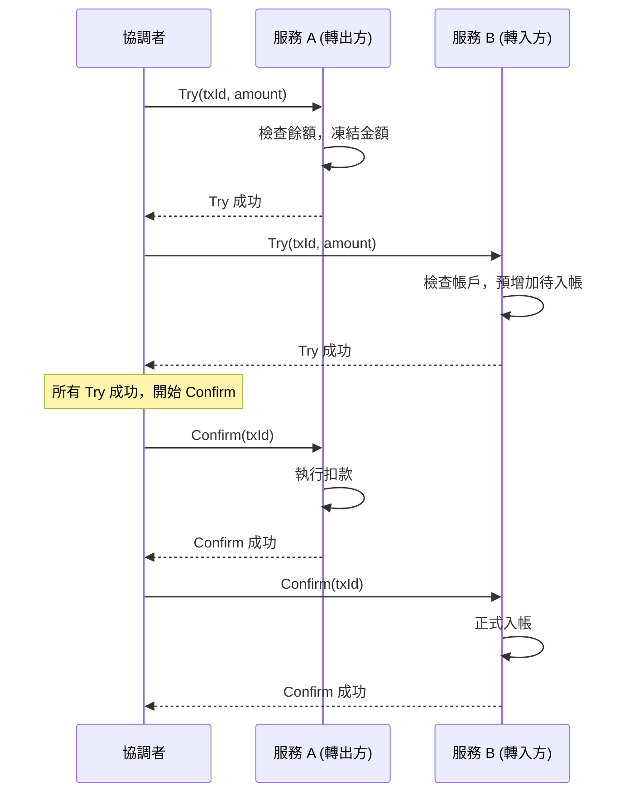
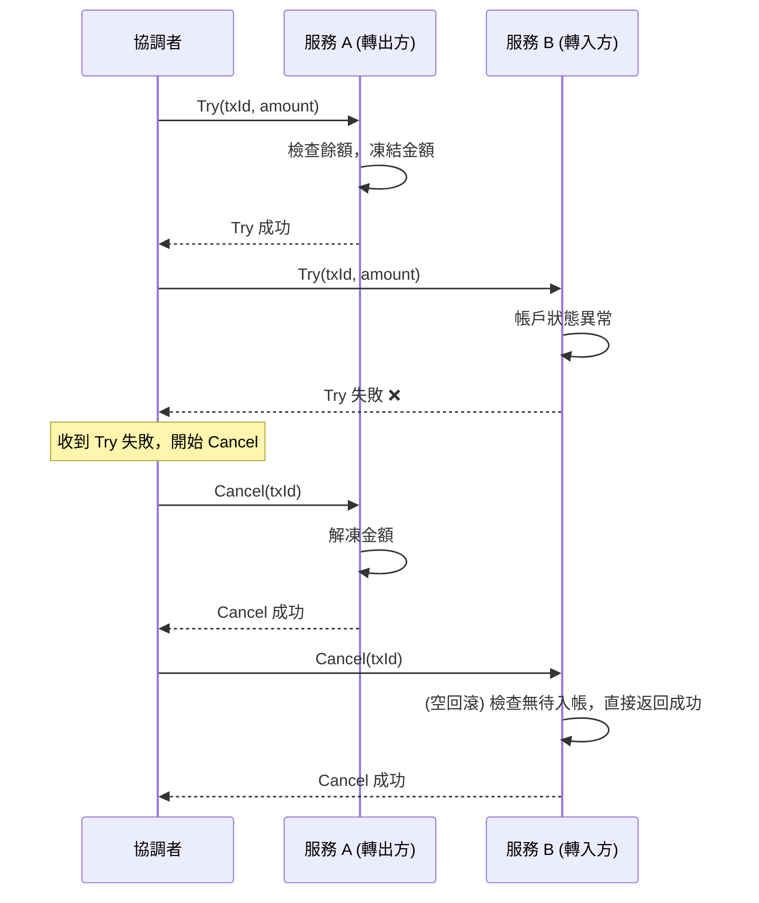

在前一篇文章中，我們探討了傳統的二階段提交（2PC）協議，它雖然保證了強一致性，但其同步阻塞和單點故障問題使其難以應用於現代微服務架構。為了解決這些問題，業界提出了一系列更為靈活的「柔性事務」方案。

今天的主角 **TCC (Try-Confirm-Cancel)** 便是其中之一。它通過一種巧妙的「應用層二階段提交」方式，在性能和數據一致性之間取得了更好的平衡。

<!-- more -->

### TCC 的核心思想：預留與確認

與 Saga 模式的「先斬後奏，錯了再補償」不同，TCC 的核心思想是「**先預留資源，再確認提交**」（Reservation-based）。

它通過 `Try` 操作預留業務資源，這個資源在 `Confirm` 或 `Cancel` 之前對其他事務是不可用的，從而提供了更好的業務隔離性。

## TCC 的三個階段詳解

讓我們以一個常見的「跨行轉帳」場景為例，這個操作涉及到用戶 A 的銀行（服務 A）和用戶 B 的銀行（服務 B）。

### 成功流程 (Try -> Confirm)



### 失敗流程 (Try -> Cancel)



### 1. Try 階段

`Try` 階段的主要任務是 **檢查業務可行性並預留資源**。

* **服務 A (轉出方)**: 檢查用戶 A 帳戶餘額，如果足夠，則 **凍結** 轉帳金額。
  * **重點**: 這裡不是直接扣款，而是將資金狀態變為「凍結中」，確保這筆錢不會被其他事務使用。
* **服務 B (轉入方)**: 檢查用戶 B 帳戶狀態是否正常，並 **預增加** 一筆待入帳記錄。

如果 `Try` 階段任一方失敗（例如餘額不足），主業務服務會立即觸發所有參與者的 `Cancel` 操作。

### 2. Confirm 階段

當所有參與者的 `Try` 操作都成功後，主業務服務會依序調用 `Confirm` 接口，**真正地執行業務**。

* **服務 A (轉出方)**: 執行實際的扣款，將凍結的金額扣除。
* **服務 B (轉入方)**: 將「待入帳」的記錄正式更新為用戶 B 的餘額。

> `Confirm` 操作必須是 **冪等** 的。因為網絡問題可能導致重試，需要確保重複調用不會導致用戶被多次扣款或入帳。

### 3. Cancel 階段

如果 `Try` 階段有任何失敗，主業務服務會調用 `Cancel` 接口，**取消所有已執行的操作，釋放預留資源**。

* **服務 A (轉出方)**: **解凍** 之前凍結的金額，使其恢復可用。
* **服務 B (轉入方)**: 刪除或標記「待入帳」記錄為無效。

> `Cancel` 操作也必須是 **冪等** 的，以應對可能的重試。

## 程式碼範例 (以 Java 為例)

為了更具體地展示 TCC 模式，以下是一個簡化的 Java 程式碼範例。我們假設有一個 `AccountService` 作為事務參與者。

### 1. 定義 TCC 接口

首先，我們定義參與者需要實現的 TCC 接口。

```java
import java.math.BigDecimal;

// TCC 參與者接口
public interface TccAction {
    // Try 階段：預留資源
    boolean prepare(String transactionId, BigDecimal amount);

    // Confirm 階段：提交事務
    boolean commit(String transactionId);

    // Cancel 階段：回滾事務
    boolean rollback(String transactionId);
}
```

#### 2. 實現轉出帳戶服務

接著，我們來實現轉出方的 `AccountService`。為了簡化，我們使用 `ConcurrentHashMap` 來模擬資料庫中的帳戶和凍結資源。

```java
import java.math.BigDecimal;
import java.util.concurrent.ConcurrentHashMap;

public class AccountService implements TccAction {

    // 模擬用戶帳戶資料庫
    private static final ConcurrentHashMap<String, BigDecimal> accounts = new ConcurrentHashMap<>();
    // 模擬凍結資源的資料庫
    private static final ConcurrentHashMap<String, BigDecimal> frozenResources = new ConcurrentHashMap<>();

    private final String accountId;

    public AccountService(String accountId, BigDecimal initialBalance) {
        this.accountId = accountId;
        accounts.put(accountId, initialBalance);
    }

    @Override
    public boolean prepare(String transactionId, BigDecimal amount) {
        System.out.printf("Attempting to prepare transaction %s for account %s with amount %.2f%n", transactionId, accountId, amount);
        
        // 檢查餘額是否足夠
        BigDecimal currentBalance = accounts.get(accountId);
        if (currentBalance.compareTo(amount) < 0) {
            System.out.printf("Account %s has insufficient funds. Current: %.2f, Required: %.2f%n", accountId, currentBalance, amount);
            return false;
        }

        // 凍結資源：從可用餘額中扣除，但不實際轉出
        accounts.computeIfPresent(accountId, (k, v) -> v.subtract(amount));
        frozenResources.put(transactionId, amount);
        System.out.printf("Successfully prepared transaction %s. Frozen %.2f from account %s. Remaining balance: %.2f%n", 
                transactionId, amount, accountId, accounts.get(accountId));
        return true;
    }

    @Override
    public boolean commit(String transactionId) {
        System.out.printf("Attempting to commit transaction %s for account %s%n", transactionId, accountId);
        if (frozenResources.containsKey(transactionId)) {
            // 確認提交，將凍結資源移除
            BigDecimal amount = frozenResources.remove(transactionId);
            System.out.printf("Successfully committed transaction %s. Released %.2f from account %s.%n", transactionId, amount, accountId);
            return true;
        }
        // 冪等性處理：如果資源已經被移除，也視為成功
        System.out.printf("Transaction %s already committed or rolled back.%n", transactionId);
        return true;
    }

    @Override
    public boolean rollback(String transactionId) {
        System.out.printf("Attempting to roll back transaction %s for account %s%n", transactionId, accountId);
        if (frozenResources.containsKey(transactionId)) {
            // 取消事務，將凍結的資源歸還給帳戶
            BigDecimal amount = frozenResources.remove(transactionId);
            accounts.computeIfPresent(accountId, (k, v) -> v.add(amount));
            System.out.printf("Successfully rolled back transaction %s. Returned %.2f to account %s.%n", transactionId, amount, accountId);
            return true;
        }
        // 冪等性處理：如果資源已經被移除，也視為成功
        System.out.printf("Transaction %s already committed or rolled back.%n", transactionId);
        return true;
    }

    public BigDecimal getBalance() {
        return accounts.get(accountId);
    }
}
```

#### 3. 實現轉入帳戶服務

接著實現轉入方的帳戶服務：

```java
import java.math.BigDecimal;
import java.util.concurrent.ConcurrentHashMap;

public class ReceiveAccountService implements TccAction {
    
    // 模擬用戶帳戶資料庫
    private static final ConcurrentHashMap<String, BigDecimal> accounts = new ConcurrentHashMap<>();
    // 模擬待入帳記錄
    private static final ConcurrentHashMap<String, BigDecimal> pendingDeposits = new ConcurrentHashMap<>();
    
    private final String accountId;
    
    public ReceiveAccountService(String accountId, BigDecimal initialBalance) {
        this.accountId = accountId;
        accounts.put(accountId, initialBalance);
    }
    
    @Override
    public boolean prepare(String transactionId, BigDecimal amount) {
        System.out.printf("Attempting to prepare deposit for account %s with amount %.2f%n", accountId, amount);
        
        // 檢查帳戶狀態是否正常（簡化處理）
        if (!accounts.containsKey(accountId)) {
            System.out.printf("Account %s does not exist.%n", accountId);
            return false;
        }
        
        // 創建待入帳記錄
        pendingDeposits.put(transactionId, amount);
        System.out.printf("Successfully prepared deposit for transaction %s. Pending amount: %.2f for account %s%n", 
                transactionId, amount, accountId);
        return true;
    }
    
    @Override
    public boolean commit(String transactionId) {
        System.out.printf("Attempting to commit deposit for account %s%n", accountId);
        
        if (pendingDeposits.containsKey(transactionId)) {
            BigDecimal amount = pendingDeposits.remove(transactionId);
            // 正式入帳
            accounts.computeIfPresent(accountId, (k, v) -> v.add(amount));
            System.out.printf("Successfully committed deposit for transaction %s. Added %.2f to account %s. New balance: %.2f%n", 
                    transactionId, amount, accountId, accounts.get(accountId));
            return true;
        }
        
        // 冪等性處理
        System.out.printf("Transaction %s already committed or rolled back.%n", transactionId);
        return true;
    }
    
    @Override
    public boolean rollback(String transactionId) {
        System.out.printf("Attempting to roll back deposit for account %s%n", accountId);
        
        if (pendingDeposits.containsKey(transactionId)) {
            BigDecimal amount = pendingDeposits.remove(transactionId);
            System.out.printf("Successfully rolled back deposit for transaction %s. Cancelled %.2f for account %s%n", 
                    transactionId, amount, accountId);
            return true;
        }
        
        // 冪等性處理
        System.out.printf("Transaction %s already committed or rolled back.%n", transactionId);
        return true;
    }
    
    public BigDecimal getBalance() {
        return accounts.get(accountId);
    }
}
```

#### 4. 事務協調器

最後，我們需要一個事務協調器來模擬整個 TCC 流程。它將調用參與者的 `prepare` 方法，並根據結果決定是 `commit` 還是 `rollback`。

```java
import java.math.BigDecimal;
import java.util.UUID;

public class TccCoordinator {

    public static void main(String[] args) {
        // 初始化帳戶：A帳戶轉出，B帳戶轉入
        AccountService senderService = new AccountService("A", new BigDecimal("1000"));
        ReceiveAccountService receiverService = new ReceiveAccountService("B", new BigDecimal("500"));
        
        System.out.printf("Initial balances: Sender A=%.2f, Receiver B=%.2f%n%n", 
                senderService.getBalance(), receiverService.getBalance());

        // --- 模擬一次成功的轉帳 ---
        System.out.println("=== Starting Successful Transaction ===");
        String txIdSuccess = UUID.randomUUID().toString();
        BigDecimal transferAmount = new BigDecimal("200");

        // 1. Try 階段：所有參與者預留資源
        boolean senderPrepared = senderService.prepare(txIdSuccess, transferAmount);
        boolean receiverPrepared = receiverService.prepare(txIdSuccess, transferAmount);

        if (senderPrepared && receiverPrepared) {
            System.out.println("All participants prepared successfully. Proceeding to commit.");
            // 2. Confirm 階段：所有參與者確認執行
            senderService.commit(txIdSuccess);
            receiverService.commit(txIdSuccess);
            System.out.println("✓ Transaction committed successfully!");
        } else {
            System.out.println("Some participants failed to prepare. Rolling back.");
            // 3. Cancel 階段：回滾所有操作
            senderService.rollback(txIdSuccess);
            receiverService.rollback(txIdSuccess);
            System.out.println("✗ Transaction rolled back.");
        }
        
        System.out.printf("Balances after successful transaction: Sender A=%.2f, Receiver B=%.2f%n%n", 
                senderService.getBalance(), receiverService.getBalance());

        // --- 模擬一次失敗的轉帳 (餘額不足) ---
        System.out.println("=== Starting Failed Transaction (Insufficient Funds) ===");
        String txIdFail = UUID.randomUUID().toString();
        BigDecimal largeAmount = new BigDecimal("1500"); // 超過餘額

        // 1. Try 階段
        boolean senderFailPrepared = senderService.prepare(txIdFail, largeAmount);
        boolean receiverFailPrepared = false;
        
        // 如果發送方準備失敗，協調器通常會立即決定回滾，不再調用其他參與者
        if (!senderFailPrepared) {
            System.out.println("Sender preparation failed. Skipping receiver preparation.");
        } else {
            receiverFailPrepared = receiverService.prepare(txIdFail, largeAmount);
        }

        if (senderFailPrepared && receiverFailPrepared) {
            // 2. Confirm 階段
            senderService.commit(txIdFail);
            receiverService.commit(txIdFail);
            System.out.println("✓ Transaction committed successfully!");
        } else {
            // 3. Cancel 階段
            System.out.println("Transaction failed. Rolling back all participants.");
            senderService.rollback(txIdFail);
            receiverService.rollback(txIdFail);
            System.out.println("✗ Transaction rolled back as expected.");
        }
        
        System.out.printf("Final balances: Sender A=%.2f, Receiver B=%.2f%n", 
                senderService.getBalance(), receiverService.getBalance());
    }
}
```

## 實際挑戰與最佳實踐

TCC 雖然解決了分布式事務的問題，但也引入了新的複雜性。開發者必須嚴格遵循設計原則，才能確保系統的穩定和一致。

### 1. 冪等性 (Idempotency)

**挑戰**: `Confirm` 和 `Cancel` 方法因為網絡重試、協調器故障恢復等原因，可能會被重複調用。
**最佳實踐**: 必須在業務邏輯中保證操作的冪等性。常見做法是記錄事務狀態，例如在執行 `Confirm` 前，先檢查該事務 ID 的狀態是否為「已確認」，如果是則直接返回成功，避免重複執行。

### 2. 空回滾 (Empty Rollback)

**挑戰**: 協調器在調用參與者的 `Try` 接口時，請求因為網絡延遲等原因尚未到達，但協調器已因超時而觸發 `Cancel`。此時參與者會收到一個沒有對應 `Try` 的 `Cancel` 請求。
**最佳實踐**: `Cancel` 接口必須能處理這種「空回滾」。實現方式是，當收到 `Cancel` 請求時，如果根據事務 ID 找不到對應的 `Try` 資源預留記錄，應直接返回成功，表示「無需回滾」。

### 3. 資源懸掛 (Resource Suspension)

**挑戰**: 這是 TCC 中最棘手的問題。`Try` 請求因為網絡擁堵，比 `Cancel` 請求更晚到達參與者。流程如下：

1. 協調器發起 `Cancel`，參與者執行了「空回滾」。
2. 遲到的 `Try` 請求終於到達，預留了業務資源。
3. 由於事務早已被標記為結束，這個被 `Try` 預留的資源將永遠無法被 `Confirm` 或 `Cancel`，造成資源洩漏。

**最佳實踐**: 解決方案是在參與者端增加一張事務控制表，記錄每個事務 ID 的執行狀態（例如：TRYING, CONFIRMED, CANCELED）。

* `Cancel` 執行空回滾時，需要向表中插入一條狀態為 `CANCELED` 的記錄。
* `Try` 執行時，除了檢查業務資源，還必須先檢查這張表。如果發現該事務 ID 已存在 `CANCELED` 記錄，應直接拒絕執行 `Try`，從而防止資源懸掛。

## 主流框架與工具

鑑於 TCC 的複雜性，直接在業務代碼中實現協調邏輯和處理各種異常情況是非常困難的。因此，通常建議使用成熟的開源框架來管理 TCC 事務。

* **Seata**: 阿里巴巴開源的分布式事務解決方案，提供了 AT、TCC、Saga 和 XA 模式。它的 TCC 模式集成了協調器和事務參與者的邏輯，能自動處理空回滾和資源懸掛問題，極大降低了開發門檻。
* **ByteTCC**: 一個基於 Java 的開源 TCC 框架，實現了輕量級的 TCC 事務協調器。
* **Hmily**: 一個基於 AOP 實現的柔性分布式事務解決方案，支持 Dubbo、Spring Cloud 等多種 RPC 框架。

## 總結

TCC 模式是一種功能強大但實現複雜的分布式事務解決方案，它通過將控制權交給應用層，提供了比 Saga 更好的隔離性，是金融等關鍵領域的首選方案之一。

### 主要優勢

* **較好的隔離性**：資源在 `Try` 階段就被鎖定，避免了 Saga 模式中的髒讀問題。
* **高性能**：相比於 2PC，避免了對資料庫資源的長時間鎖定，具有更高的吞吐量。
* **靈活性**：業務邏輯完全由開發者控制，可以應對複雜的場景。

### 注意事項

* **業務侵入性極強**：需要將業務邏輯拆分為三個部分，對現有代碼的改造量巨大。
* **開發複雜度高**：開發者必須自行處理冪等、空回滾、資源懸掛這三大難題，對團隊技術水平要求高。
* **依賴協調器**：需要一個獨立的 TCC 協調器服務來推進事務狀態，這也引入了額外的維護成本和潛在的單點故障風險。

在選擇是否使用 TCC 時，需要仔細評估業務場景對一致性的要求、團隊的技術實力以及項目的開發週期。

## 參考資料

* [Seata TCC 模式](https://seata.io/zh-cn/docs/dev/mode/tcc-mode/)
* [微服務架構的分布式事務解決方案](https://www.cnblogs.com/savorboard/p/distributed-system-transaction-consistency.html)
* [TCC 分散式事務架構設計與實現](https://tech.meituan.com/2018/11/15/dianping-tcc.html)
